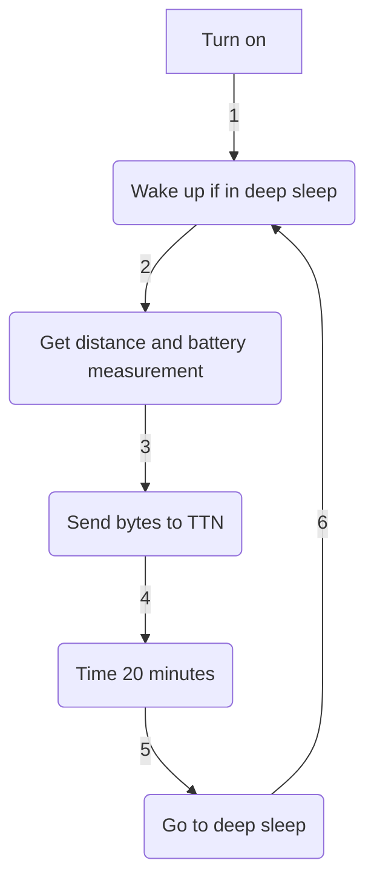

# SENSOR COOPER V3.2 - MEDIALAB LPWAN: ULTRASONIC SENSOR FOR MEASURING SAN MIGUEL'S CREEK WATER LEVEL

## Project based on: https://github.com/rwanrooy/TTGO-PAXCOUNTER-LoRa32-V2.1-TTN

In honour of Martin Cooper and Arlene Harris and their vision of IoP, The Internet of People, in MediaLab_ LPWAN, we wanted to develop an IoT device that could improve the quality of the Polytechnic School of Engineering of Gijón. As a result, the idea of the Cooper Sensor came in as a LoRa device that could be left without any need of mantainance measuring the water level of San Miguel's creek.


With these sensors, the aim is to monitor the possibility of a flood in the main building during the heavy rains season. Specifically, in 2018, a major flood took place turning useless many expensive equipment from the lower floors that were used by the students during the laboratory practices of many subjetcs:

.jpg)
.jpg)
.jpg)

### Component list:

| Component | Model |
| ------------- | ------------- |
| Dev Module  | LilyGO LoRa32 OLED v2.1_1.6 |
| Distance sensor  | JSN-SR04T |
| Battery  | 18650 |
| Solar panel  | SYP-S0606 |
| PCB  | Custom (file included) |
| Housing  | Custom (file included) |

### Connection list:

| JSN-SR04T | 18650 | SYP-S0606 | LilyGO |
| ------------- | ------------- | ------------- | ------------- |
| trigger | - | - | 13 |
| echo | - | - | 12 |
| 5v | - | - | 00 |
| GND | - | - | GND |
| - | Bat Conn | - | Bat Conn |
| - | - | USB | USB |

> [!TIP]
> The PCB offers the possibility to connect a button between GPIO23 and GND to be programmed as desired

### Flowchart


### Libraries:

- LilyGO board library (Paste the link on the preferences tab and choose board as "TTGO LoRa32 OLED" in Arduino IDE): https://github.com/Xinyuan-LilyGO/LilyGo-LoRa-Series/blob/master/boards/t3_s3_v1_x.json

- LMIC (Copy the contents of the project file main/lmic_project_config.h to the library file arduino-lmic/project_config/lmic_project_config.h and uncomment the proper frequency for your region. The sketch does always look at the library folder for the configured region): https://github.com/mcci-catena/arduino-lmic

- QuickMedianLib (To obtain more solid distance values): https://github.com/luisllamasbinaburo/Arduino-QuickMedian

- ESP sleep (To reduce battery consumption): https://github.com/pycom/pycom-esp-idf/blob/master/components/esp32/include/esp_sleep.h

> [!NOTE]
> Other libraries, like SPI library, are easily downloadable from Arduino IDE

### Main features:

- Developed using LilyGO LoRa32 OLED v2.1_1.6 (supports solar recharging and battery management)

  

- Changes made for JSN-SR04T: ultrasonic distance sensor

  

- Custom PCB

  

- Dynamic Data Transmission Rate implementation: send interval dynamically changes its value depending on the typical deviation from the latest 5 distances sent to The Things Network (By OTAA; file "payload_formatter.json" is a suggestion on how to decode the sent bytes)

  

- Custom housing to fit all the elements in the most efficient way

  
  

> [!WARNING]
> Clear colour PETG 3D printing filament is recommended to survive sun radiation and plastic deformations

The first unit has been deployed near the Polytechnic School of Engineering of Gijón:


```geojson
{
  "type": "FeatureCollection",
  "features": [
    {
      "type": "Feature",
      "id": 1,
      "properties": {
        "ID": 0
      },
      "geometry": {
        "type": "Point",
        "coordinates": [-5.634150, 43.525664]
      },
      "properties": {
        "name": "Location Marker"
      }
    }
  ]
}
```

```topojson
{
  "type": "Topology",
  "transform": {
    "scale": [0.0005000500050005, 0.00010001000100010001],
    "translate": [100, 0]
  },
  "objects": {
    "example": {
      "type": "GeometryCollection",
      "geometries": [
        {
          "type": "Point",
          "properties": {"prop0": "value0"},
          "coordinates": [4000, 5000]
        },
        {
          "type": "LineString",
          "properties": {"prop0": "value0", "prop1": 0},
          "arcs": [0]
        },
        {
          "type": "Polygon",
          "properties": {"prop0": "value0",
            "prop1": {"this": "that"}
          },
          "arcs": [[1]]
        }
      ]
    }
  },
  "arcs": [[[4000, 0], [1999, 9999], [2000, -9999], [2000, 9999]],[[0, 0], [0, 9999], [2000, 0], [0, -9999], [-2000, 0]]]
}
```

Access the Grafana panel via this QR code or the link below it:


http://4f566df1fed52c6e7fd5f661f64ae3eb.balena-devices.com:8080/d/vJhQNCZgz/sensores-jsn-sr04t-arroyo-de-san-miguel?from=now-24h&orgId=1&to=now&refresh=1m

> [!IMPORTANT]
> We will kindly answer doubts and read suggestions via e-mail: medialablpwan@gmail.com :shipit:

_Authors: Daniel Rodríguez Moya, Óscar Gijón, Ramón Rubio and MediaLab LPWAN Workgroup_
