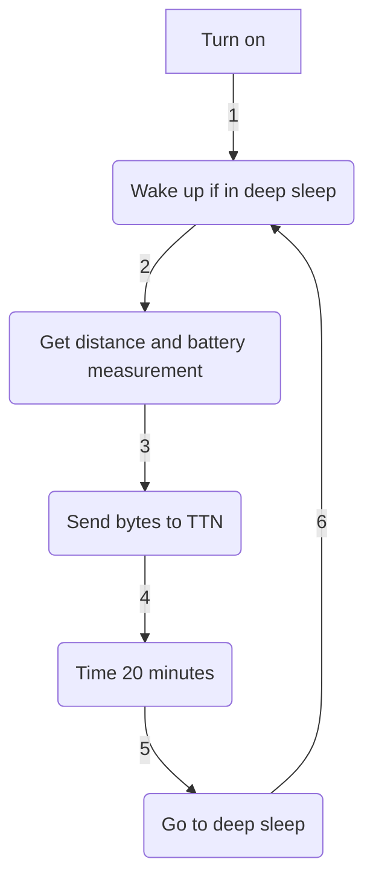

# 
 SENSOR COOPER V3.2 - MEDIALAB LPWAN: ULTRASONIC SENSOR FOR MEASURING SAN MIGUEL'S CREEK WATER LEVEL 

## 
 Project based on: https://github.com/rwanrooy/TTGO-PAXCOUNTER-LoRa32-V2.1-TTN 

 In honour of Martin Cooper, Princesa de Asturias Award 2009, and Arlene Harris and their vision of IoP, The Internet of People, in MediaLab_ LPWAN, we wanted to develop an IoT device that could improve the quality of the Polytechnic School of Engineering of Gijón. As a result, the idea of the Cooper Sensor came in as a LoRa device that could be left without any need of mantainance measuring the water level of San Miguel's creek. 

  

 

 With these sensors, the aim is to monitor the possibility of a flood in the main building during the heavy rains season. Specifically, in 2018, a major flood took place turning useless many expensive equipment from the lower floors that were used by the students during the laboratory practices of many subjetcs: 

  

 

  

 

  

 

 In this repo, you will find all the files and teaching guides required to understand and even take the creative freedom to improve this project. 

___

### 
 Component list: 

| Component | Model |
| ------------- | ------------- |
| Dev Module  | LilyGO LoRa32 OLED v2.1_1.6 |
| Distance sensor  | JSN-SR04T |
| Battery  | 18650 |
| Solar panel  | SYP-S0606 |
| PCB  | Custom (file included) |
| Housing  | Custom (file included) |

___

### 
 Connection list: 

| JSN-SR04T | 18650 | SYP-S0606 | LilyGO |
| ------------- | ------------- | ------------- | ------------- |
| `trigger` | - | - | `13` |
| `echo` | - | - | `12` |
| `5v` | - | - | `00` |
| `GND` | - | - | `GND` |
| - | `Bat Conn` | - | `Bat Conn` |
| - | - | `USB` | `USB` |

> [!TIP]
> The PCB (More info coming below) offers the possibility to connect a button between GPIO23 and GND to be programmed as desired

___

### 
 Flowchart (Simplified!) 

> [!TIP]
> Inside of folder `lorawaterlevelmonitoring/main`, the code is available and ready to flash or edit. The most important files to edit are `sensor.ino`, where any sensor can be implemented, and `configuration.h`, where the peripherals' macros are declared

> [!CAUTION]
> Additional code may be needed if implementing I2C I/O. The functions to make them work are in the original project in `TTGO-PAXCOUNTER-LoRa32-V2.1-TTN/main/main.ino`

___

### 
 Libraries: 

- 
 LilyGO board library (Paste the link on the [Preferences] tab and choose [TTGO LoRa32 OLED] as [Board] in Arduino IDE): https://github.com/Xinyuan-LilyGO/LilyGo-LoRa-Series/blob/master/boards/t3_s3_v1_x.json

- 
 LMIC (Copy the contents of the project file [main/lmic_project_config.h] to the library file [arduino-lmic/project_config/lmic_project_config.h] and uncomment the proper frequency for your region. The sketch does always look at the library folder for the configured region!): https://github.com/mcci-catena/arduino-lmic 

- 
 QuickMedianLib (To obtain more solid distance values): https://github.com/luisllamasbinaburo/Arduino-QuickMedian 

- 
 ESP sleep (To reduce battery consumption): https://github.com/pycom/pycom-esp-idf/blob/master/components/esp32/include/esp_sleep.h 

> [!NOTE]
> Other libraries, like SPI library, are easily downloadable from Arduino IDE

___

### 
 Main features: 

- 
 Developed using LilyGO LoRa32 OLED v2.1_1.6 (Supports solar recharging and battery management) 

  

    
  

   

- 
 Changes made for JSN-SR04T (Ultrasonic distance sensor) 

  

    
  

   

- 
 Dynamic Data Transmission Rate implementation: send interval dynamically changes its value between 20 and 40 minutes depending on the typical deviation from the latest 5 distances sent to The Things Network (By OTAA; file [payload_formatter.json] is a suggestion on how to decode the sent bytes) 

  

    
  

   

- 
 Custom PCB 

  

    
  

   

> [!TIP]
> Consider soldering female pin connectors so the electronic components can simply be plugged in and unplugged if a repair has to be done

- 
 Custom housing to fit all the elements in the most efficient way 

  

    
  

   
  

    
  

   

> [!WARNING]
> Clear colour PETG 3D printing filament is recommended to survive sun radiation and plastic deformations. An O-ring is also a good choice to fix and stabilize the sensor inside of the bell. Four M3 screws are needed to fix the assembly

___

 The first unit has been deployed near the Polytechnic School of Engineering of Gijón: 

  

 

  

 

___

Access the Grafana panel[^1] via this QR code or the link below it:

  

 

 Link: http://4f566df1fed52c6e7fd5f661f64ae3eb.balena-devices.com:8080/d/vJhQNCZgz/sensores-jsn-sr04t-arroyo-de-san-miguel?from=now-24h&orgId=1&to=now&refresh=1m 

> [!IMPORTANT]
> We will kindly answer doubts and read suggestions via e-mail: medialablpwan@gmail.com :shipit:

_
 Authors: Daniel Rodríguez Moya, Óscar Gijón, Ramón Rubio and MediaLab LPWAN Workgroup 
_

[^1]: Instructions on how to deploy Grafana panels are given on the repo `medialablpwan/documentacion`.
