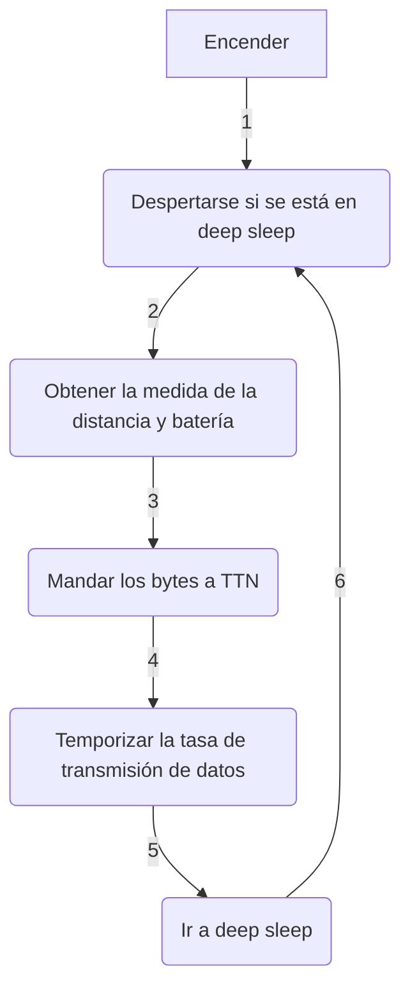

<div align="right">

[](./README.md) | [](./README_ES.md)

</div>

# <p align="justify"> SENSOR COOPER V3.2 - MEDIALAB_ LPWAN: SENSOR ULTRASÓNICO CONECTADOR POR LORA PARA MEDIR EL NIVEL DE AGUA DEL ARROYO DE SAN MIGUEL </p>

<div align="center">

_Hecho con_

[](https://www.arduino.cc/) [](https://www.lilygo.cc/)

## Proyecto basado en: [rwanrooy/TTGO-PAXCOUNTER-LoRa32-V2.1-TTN](https://github.com/rwanrooy/TTGO-PAXCOUNTER-LoRa32-V2.1-TTN)

</div>

___

<div align="justify">

## Índice
- [Introducción](https://github.com/medialablpwan/lorawaterlevelmonitoring/tree/main#introduction-leftwards_arrow_with_hook)
- [Funciones principales](https://github.com/medialablpwan/lorawaterlevelmonitoring/tree/main#-main-features-leftwards_arrow_with_hook-)
- [Lista de componentes](https://github.com/medialablpwan/lorawaterlevelmonitoring/tree/main#-component-list-leftwards_arrow_with_hook-)
- [Lista de conexiones](https://github.com/medialablpwan/lorawaterlevelmonitoring/tree/main#-connection-list-leftwards_arrow_with_hook-)
- [Flujograma (¡Simplificado!)](https://github.com/medialablpwan/lorawaterlevelmonitoring/tree/main#-flowchart-simplified-leftwards_arrow_with_hook-)
- [Archivos de código](https://github.com/medialablpwan/lorawaterlevelmonitoring/tree/main#code-files-leftwards_arrow_with_hook)
- [Librarías](https://github.com/medialablpwan/lorawaterlevelmonitoring/tree/main#libraries-leftwards_arrow_with_hook)
- [Experimento de despliegue](https://github.com/medialablpwan/lorawaterlevelmonitoring/tree/main#-deployment-experiment-leftwards_arrow_with_hook-)
- [Licencia](https://github.com/medialablpwan/lorawaterlevelmonitoring/tree/main#-license-leftwards_arrow_with_hook-)
- [Contacto](https://github.com/medialablpwan/lorawaterlevelmonitoring/tree/main#-contact-leftwards_arrow_with_hook-)

</div>

___

<div align="justify">

## Introducción [:leftwards_arrow_with_hook:](https://github.com/medialablpwan/lorawaterlevelmonitoring/tree/main#table-of-contents)

En homenaje a Martin Cooper, inventor del teléfono móvil en 1973 y Premio Princesa de Asturias 2009, y Arlene Harris y su visión del Internet de las Personas, en MediaLab LPWAN quisimos desarrollar un dispositivo IoT que pudiese mejorar la calidad del campus de la Escuela Politécnica de Ingeniería de Gijón. Como resultado, la idea del Sensor Cooper nació como un nodo conectado por LoRa, sincronizable con The Things Network, que pudiese quedar midiendo el nivel de agua del Arroyo de San Miguel sin ninguna necesidad de hacerle mantenimientos.

</div>

<div align="center">
  
</div>
<br/>

<p align="justify"> Con estos sensores, el objetivo es monitorizar la posibilidad de una inundación en el Edificio Polivalente durante la temporada de lluvias intensas. Específicamente, en 2018, una gran inundación tuvo lugar dejando inservible multitud de equipamiento valorado en decenas de miles de euros que estaban siendo usados por los estudiantes durante las prácticas de laboratorio de diversas asignaturas. Por ello, ésta es una situación que no podemos dejar que se repita: </p>

<div align="center">
  
</div>
<br/>
<div align="center">
  
</div>
<br/>
<div align="center">
  
</div>
<br/>

<p align="justify"> En este repositorio, encontrarás todos los archivos y guías educativas necesarias para entender con totalidad e incluso tomarte la libertad creativa de mejorar este proyecto. Las carpetas y archivos han sido llamados con nombres que se explican a ellos mismos para hacer la navegación más intuitiva. </p>

___

### <p align="justify"> Características principales [:leftwards_arrow_with_hook:](https://github.com/medialablpwan/lorawaterlevelmonitoring/tree/main#table-of-contents) </p>

- <p align="justify"> Desarrollado usando la LilyGO LoRa32 OLED v2.1_1.6 (Una placa basada en ESP32 con LoRa implementado y que soporta recarga con panel solar y gestión de batería) </p>

  <div align="center">
    
  </div>
  <br/>

- <p align="justify"> Cambios realizados para JSN-SR04T (Sensor ultrasónico de distancia) </p>

  <div align="center">
    
  </div>
  <br/>

> [!WARNING]
> Este sensor es extremádamente sensible a perturbaciones físicas. Estate seguro de alinearlo perfectamente de forma perpendicular con la superficie donde rebote el haz y de tener visión directa a ella

<div align="justify">

- Tasa dinámica de transmisión de datos: el intervalo de envío cambia automáticamente su valor entre 20 y 40 minutos en función de la desviación típica de las últimas 5 medidas enviadas a TTN. (Por OTAA, [`payload_formatter.json`](https://github.com/medialablpwan/lorawaterlevelmonitoring/blob/main/payload_formatter.json) es una sugerencia de cómo decodificar los bytes enviados)

  <div align="center">
    
  </div>
  <br/>

</div>

- <p align="justify"> PCB a medida </p>

  <div align="center">
    
  </div>
  <br/>

> [!TIP]
> Considera soldar conectores hembra para pines para que los componentes se puedan conectar y desconectar de forma simple en caso de tener que hacer una reparación

- <p align="justify"> Carcasa a medida para encajar todos los componentes de la forma más eficiente (Recipiente + Soporte del panel solar + Protector del conector USB) </p>

  <div align="center">
    
  </div>
  <br/>
  <div align="center">
    
  </div>
  <br/>
  <div align="center">
    
  </div>
  <br/>

  > Ejemplo de ensamblaje:
  <div align="center">
    
  </div>
  <br/>

> [!WARNING]
> Filamento de impresión 3D de PETG de color claro es muy recomendable para sobrevivir a la radiación solar y a las deformaciones plásticas. Una tórica es una buena opción para fijar y estabilizar el sensor dentro de la campana. Hacen falta cuatro tornillos M3 para fijar el ensamblado

___

### <p align="justify"> Lista de componentes [:leftwards_arrow_with_hook:](https://github.com/medialablpwan/lorawaterlevelmonitoring/tree/main#table-of-contents) </p>

<div align="center">

| Componente | Modelo |
| ------------- | ------------- |
| Placa  | [LilyGO LoRa32 OLED v2.1_1.6](https://www.tinytronics.nl/shop/en/development-boards/microcontroller-boards/with-lora/lilygo-ttgo-t3-lora32-868mhz-v1.6.1-esp32) |
| Sensor de distancia  | [JSN-SR04T](https://www.tinytronics.nl/shop/en/sensors/distance/waterproof-ultrasonic-sensor-jsn-sr04t) |
| Batería  | [18650](https://www.tinytronics.nl/shop/en/power/batteries/18650/eve-18650-li-ion-battery-3100mah-10a-inr18650-33v) |
| Panel solar  | [SYP-S0606](https://www.tinytronics.nl/shop/en/power/solar-energy/solar-panels/solar-panel-with-dc-dc-converter-and-usb-5v-1a) |
| PCB  | [A medida (archivo incluido)](https://github.com/medialablpwan/lorawaterlevelmonitoring/tree/main/pcb) |
| Carcasa  | [A medida (archivo inlcuido)](https://github.com/medialablpwan/lorawaterlevelmonitoring/tree/main/carc) |

</div>

___

### <p align="justify"> Lista de conexiones [:leftwards_arrow_with_hook:](https://github.com/medialablpwan/lorawaterlevelmonitoring/tree/main#table-of-contents) </p>

<div align="center">

| JSN-SR04T | 18650 | SYP-S0606 | LilyGO |
| ------------- | ------------- | ------------- | ------------- |
| `trigger` | - | - | `13` |
| `echo` | - | - | `12` |
| `5v` | - | - | `00` |
| `GND` | - | - | `GND` |
| - | `Con Bat` | - | `Con Bat` |
| - | - | `USB` | `USB` |

</div>

> En una protoboard se ve de la siguienta forma:

<div align="center">
  
</div>
<br/>

> [!TIP]
> La PCB ofrece la posibilidad de conectar un botón entre GPIO23 y GND para ser programado como se desee

___

### <p align="justify"> Flujograma (¡Simplificado!) [:leftwards_arrow_with_hook:](https://github.com/medialablpwan/lorawaterlevelmonitoring/tree/main#table-of-contents) </p>



___

<div align="justify">

### Archivos de código [:leftwards_arrow_with_hook:](https://github.com/medialablpwan/lorawaterlevelmonitoring/tree/main#table-of-contents)

In this section, a brief description on how the code is distributed among files in [`medialablpwan/lorawaterlevelmonitoring/main/`](https://github.com/medialablpwan/lorawaterlevelmonitoring/tree/main/main), where the code is available and ready to flash or edit, is given:

- [`main.ino`](https://github.com/medialablpwan/lorawaterlevelmonitoring/blob/main/main/main.ino)
  ```C
  /*
  Definition of global functions
  Variables to be stored in the RTC memory
  'setup()' and 'loop()' functions
  */
  ```
- [`sensor.ino`](https://github.com/medialablpwan/lorawaterlevelmonitoring/blob/main/main/sensor.ino)
  ```C
  /*
  Functions and variables needed to make a sensor work
  */
  ```
- [`ddc.ino`](https://github.com/medialablpwan/lorawaterlevelmonitoring/blob/main/main/ddc.ino)
  ```C
  /*
  Functions and variables for the implementation of the dynamic data transfer rate
  */
- [`sleep.ino`](https://github.com/medialablpwan/lorawaterlevelmonitoring/blob/main/main/sleep.ino)
  ```C
  /*
  Functions to activate ESP32's deep sleep mode
  */
- [`ttn.ino`](https://github.com/medialablpwan/lorawaterlevelmonitoring/blob/main/main/ttn.ino)
  ```C
  /*
  Functions from LMIC library
  */
- [`configuration.h`](https://github.com/medialablpwan/lorawaterlevelmonitoring/blob/main/main/configuration.h)
  ```C
  /*
  Sensor macros and boolean toggles
  */
- [`credentials.h`](https://github.com/medialablpwan/lorawaterlevelmonitoring/blob/main/main/credentials.h)
  ```C
  /*
  OTAA keys for TTN synchronization
  */
- [`lmic_project_config.h`](https://github.com/medialablpwan/lorawaterlevelmonitoring/blob/main/main/lmic_project_config.h)
  ```C
  /*
  LoRa frequency band and radio chip selector
  */
A more in depth analysis is given in the code itself as comments explain what each function does.

</div>

> [!TIP]
> The most important files to edit are `sensor.ino`, where any sensor can be implemented, and `configuration.h`, where the peripherals' macros are declared

> [!CAUTION]
> Additional code may be needed if implementing I2C I/O. The functions to make them work are in the original project in [`TTGO-PAXCOUNTER-LoRa32-V2.1-TTN/main/main.ino`](https://github.com/rwanrooy/TTGO-PAXCOUNTER-LoRa32-V2.1-TTN/blob/master/main/main.ino)

___

<div align="justify">

### Libraries [:leftwards_arrow_with_hook:](https://github.com/medialablpwan/lorawaterlevelmonitoring/tree/main#table-of-contents)

- LilyGO board library (Paste the link on the `Preferences` tab and choose `TTGO LoRa32 OLED` as `Board` in Arduino IDE): https://github.com/Xinyuan-LilyGO/LilyGo-LoRa-Series/blob/master/boards/t3_s3_v1_x.json

- LMIC (Copy the contents of the project file `main/lmic_project_config.h` to the library file `arduino-lmic/project_config/lmic_project_config.h` and uncomment the proper frequency for your region. The sketch does always look at the library folder for the configured region!): https://github.com/mcci-catena/arduino-lmic

- QuickMedianLib (To obtain more solid distance values): https://github.com/luisllamasbinaburo/Arduino-QuickMedian

- ESP sleep (To reduce battery consumption): https://github.com/pycom/pycom-esp-idf/blob/master/components/esp32/include/esp_sleep.h

</div>

> [!NOTE]
> Other libraries, like SPI library, are easily downloadable from Arduino IDE

___

___

## <p align="justify"> Deployment experiment [:leftwards_arrow_with_hook:](https://github.com/medialablpwan/lorawaterlevelmonitoring/tree/main#table-of-contents) </p>

### <p align="justify"> The first unit has been deployed near the Polytechnic School of Engineering of Gijón: </p>

<div align="center">
  
</div>
<br/>
<div align="center">
  
</div>
<br/>

___

### Access the Grafana panel[^1] via this QR code or the link below it:

<div align="center">
  
</div>
<br/>

<p align="center"> http://4f566df1fed52c6e7fd5f661f64ae3eb.balena-devices.com:8080/d/vJhQNCZgz/sensores-jsn-sr04t-arroyo-de-san-miguel?from=now-24h&orgId=1&to=now&refresh=1m </p>

___

___

## <p align="justify"> License [:leftwards_arrow_with_hook:](https://github.com/medialablpwan/lorawaterlevelmonitoring/tree/main#table-of-contents) </p>

This project is licensed under the [GPL-3.0 license](https://github.com/rwanrooy/TTGO-PAXCOUNTER-LoRa32-V2.1-TTN/blob/master/LICENSE). Contains code from [rwanrooy/TTGO-PAXCOUNTER-LoRa32-V2.1-TTN](https://github.com/rwanrooy/TTGO-PAXCOUNTER-LoRa32-V2.1-TTN)

___

### <p align="justify"> Contact [:leftwards_arrow_with_hook:](https://github.com/medialablpwan/lorawaterlevelmonitoring/tree/main#table-of-contents) </p>

> [!IMPORTANT]
> We will kindly answer doubts and read suggestions: [](mailto:medialablpwan@gmail.com)
> 
> More info about our activities: [](https://www.linkedin.com/groups/9298597/)

_<p align="justify"> Authors: Daniel Rodríguez Moya, Óscar Gijón, Ramón Rubio and MediaLab LPWAN Workgroup :shipit: </p>_

[^1]: Instructions on how to deploy Grafana panels are given on the repo [`medialablpwan/documentacion`](https://github.com/medialablpwan/documentacion).
