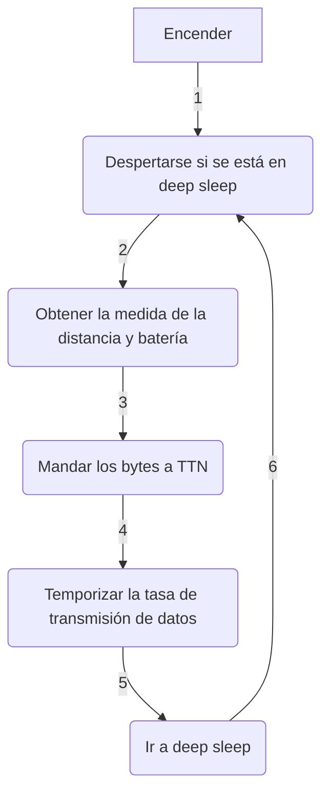

<div align="right">

[](./README.md) | [](./README_ES.md)

</div>


# <p align="justify"> SENSOR COOPER V3.2 - MEDIALAB_ LPWAN: SENSOR ULTRASÓNICO CONECTADO POR LORA PARA MEDIR EL NIVEL DE AGUA DEL ARROYO DE SAN MIGUEL </p>

<div align="center">

_Hecho con_

[](https://www.arduino.cc/) [](https://www.lilygo.cc/)

## Proyecto basado en: [rwanrooy/TTGO-PAXCOUNTER-LoRa32-V2.1-TTN](https://github.com/rwanrooy/TTGO-PAXCOUNTER-LoRa32-V2.1-TTN)

</div>

___

<div align="justify">

## Índice
- [Introducción](https://github.com/medialablpwan/lorawaterlevelmonitoring/blob/main/README_ES.md#introducci%C3%B3n-leftwards_arrow_with_hook)
- [Funciones principales](https://github.com/medialablpwan/lorawaterlevelmonitoring/blob/main/README_ES.md#-caracter%C3%ADsticas-principales-leftwards_arrow_with_hook-)
- [Lista de tareas](https://github.com/medialablpwan/lorawaterlevelmonitoring/tree/main?tab=readme-ov-file#to-do-list-leftwards_arrow_with_hook)
- [Lista de componentes](https://github.com/medialablpwan/lorawaterlevelmonitoring/blob/main/README_ES.md#-lista-de-componentes-leftwards_arrow_with_hook-)
- [Lista de conexiones](https://github.com/medialablpwan/lorawaterlevelmonitoring/blob/main/README_ES.md#-lista-de-conexiones-leftwards_arrow_with_hook-)
- [Flujograma (¡Simplificado!)](https://github.com/medialablpwan/lorawaterlevelmonitoring/blob/main/README_ES.md#-flujograma-simplificado-leftwards_arrow_with_hook-)
- [Archivos de código](https://github.com/medialablpwan/lorawaterlevelmonitoring/blob/main/README_ES.md#archivos-de-c%C3%B3digo-leftwards_arrow_with_hook)
- [Librerías](https://github.com/medialablpwan/lorawaterlevelmonitoring/blob/main/README_ES.md#librer%C3%ADas-leftwards_arrow_with_hook)
- [Experimento de despliegue](https://github.com/medialablpwan/lorawaterlevelmonitoring/blob/main/README_ES.md#-experimento-de-despliegue-leftwards_arrow_with_hook-)
- [Licencia](https://github.com/medialablpwan/lorawaterlevelmonitoring/blob/main/README_ES.md#-licencia-leftwards_arrow_with_hook-)
- [Contacto](https://github.com/medialablpwan/lorawaterlevelmonitoring/blob/main/README_ES.md#-contacto-leftwards_arrow_with_hook-)

</div>

___

<div align="justify">

## Introducción [:leftwards_arrow_with_hook:](https://github.com/medialablpwan/lorawaterlevelmonitoring/blob/main/README_ES.md#%C3%ADndice)

En homenaje a Martin Cooper, inventor del teléfono móvil en 1973 y Premio Princesa de Asturias 2009, y Arlene Harris y su visión del Internet de las Personas, en MediaLab LPWAN quisimos desarrollar un dispositivo IoT que pudiese mejorar la calidad del campus de la Escuela Politécnica de Ingeniería de Gijón. Como resultado, la idea del Sensor Cooper nació como un nodo conectado por LoRa, sincronizable con [The Things Network](https://www.thethingsnetwork.org/), que pudiese quedar midiendo el nivel de agua del Arroyo de San Miguel sin ninguna necesidad de hacerle mantenimientos.

</div>

<div align="center">
  
</div>
<br/>

<p align="justify"> Con estos sensores, el objetivo es monitorizar la posibilidad de una inundación en el Edificio Polivalente durante la temporada de lluvias intensas. Específicamente, en 2018, una gran inundación tuvo lugar dejando inservible multitud de equipamiento valorado en decenas de miles de euros que estaban siendo usados por los estudiantes durante las prácticas de laboratorio de diversas asignaturas. Por ello, ésta es una situación que no podemos dejar que se repita: </p>

<div align="center">
  
</div>
<br/>
<div align="center">
  
</div>
<br/>
<div align="center">
  
</div>
<br/>

<p align="justify"> En este repositorio, encontrarás todos los archivos y guías educativas necesarias para entender con totalidad e incluso tomarte la libertad creativa de mejorar este proyecto. Las carpetas y archivos han sido llamados con nombres que se explican a ellos mismos para hacer la navegación más intuitiva. </p>

___

### <p align="justify"> Características principales [:leftwards_arrow_with_hook:](https://github.com/medialablpwan/lorawaterlevelmonitoring/blob/main/README_ES.md#%C3%ADndice) </p>

- <p align="justify"> Desarrollado usando la LilyGO LoRa32 OLED v2.1_1.6 (Una placa basada en ESP32 con LoRa implementado y que soporta recarga con panel solar y gestión de batería) </p>

  <div align="center">
    
  </div>
  <br/>

- <p align="justify"> Cambios realizados para JSN-SR04T (Sensor ultrasónico de distancia) </p>

  <div align="center">
    
  </div>
  <br/>

> [!WARNING]
> Este sensor es extremádamente sensible a perturbaciones físicas. Estate seguro de alinearlo perfectamente de forma perpendicular con la superficie donde rebote el haz y de tener visión directa a ella

<div align="justify">

- Tasa dinámica de transmisión de datos: el intervalo de envío cambia automáticamente su valor entre 20 y 40 minutos en función de la desviación típica de las últimas 5 medidas enviadas a TTN. (Por OTAA, [`payload_formatter.json`](https://github.com/medialablpwan/lorawaterlevelmonitoring/blob/main/payload_formatter.json) es una sugerencia de cómo decodificar los bytes enviados)

  <div align="center">
    
  </div>
  <br/>

</div>

- <p align="justify"> PCB a medida </p>

  <div align="center">
    
  </div>
  <br/>

> [!TIP]
> Considera soldar conectores hembra para pines para que los componentes se puedan conectar y desconectar de forma simple en caso de tener que hacer una reparación

- <p align="justify"> Carcasa a medida para encajar todos los componentes de la forma más eficiente (Recipiente + Soporte del panel solar + Protector del conector USB) </p>

  <div align="center">
    
  </div>
  <br/>
  <div align="center">
    
  </div>
  <br/>
  <div align="center">
    
  </div>
  <br/>

  > Ejemplo de ensamblaje:
  <div align="center">
    
  </div>
  <br/>

> [!WARNING]
> Es muy recomendable emplear filamento de impresión 3D de PETG de color claro para sobrevivir a la radiación solar y a las deformaciones plásticas. Una tórica es una buena opción para fijar y estabilizar el sensor dentro de la campana. Hacen falta cuatro tornillos M3 para fijar el ensamblado

___

<div align="justify">

### Lista de tareas [:leftwards_arrow_with_hook:](https://github.com/medialablpwan/lorawaterlevelmonitoring/tree/main#table-of-contents)

La lista siguiente enumera todas las tareas que conforman el proceso de investigación del proyecto y si se han completado de forma estricta:

- [ ] Entendimiento total de la placa de desarrollo y sus pines
```diff
- Algunos pines son conflictivos debido a la falta de documentación del fabricante, por
- lo que aún se están haciendo pruebas
```

- [x] Entendimiento total del modo de trabajo del sensor y modos alternativos

- [x] Implementación por código del sensor

- [x] Implementación por código de LoRa

- [x] Implementación por código del modo de bajo consumo

- [ ] Componentes para el modo de bajo consumo
```diff
- Se está intentando implementar un transistor para dejar sin 5V de alimentación al
- sensor durante el deep sleep, pero está siendo "retorcido"
```

</div>

<div align="center">
  
</div>
<br/>

<div align="justify">

- [ ] Diseño de la PCB
```diff
- Ya que el hardware para el modo de bajo consumo aún no se ha implementado con
- éxito, la PCB debe esperar
```

- [x] Modelado 3D de la carcasa
      
- [x] Aplicación para visualizar los datos

</div>

___

### <p align="justify"> Lista de componentes [:leftwards_arrow_with_hook:](https://github.com/medialablpwan/lorawaterlevelmonitoring/blob/main/README_ES.md#%C3%ADndice) </p>

<div align="center">

| Componente | Modelo |
| ------------- | ------------- |
| Placa  | [LilyGO LoRa32 OLED v2.1_1.6](https://www.tinytronics.nl/shop/en/development-boards/microcontroller-boards/with-lora/lilygo-ttgo-t3-lora32-868mhz-v1.6.1-esp32) |
| Sensor de distancia  | [JSN-SR04T](https://www.tinytronics.nl/shop/en/sensors/distance/waterproof-ultrasonic-sensor-jsn-sr04t) |
| Transistor NPN  | [2N2222](https://www.amazon.es/BOJACK-Valores-General-Purpose-Transistors/dp/B07T2VBBLV/ref=sr_1_5?keywords=Transistor-npn&qid=1703287435&sr=8-5) |
| Resistencia  | [2k2](https://www.amazon.es/BOJACK-valores-resistencias-pel%C3%ADcula-carbono/dp/B08FD1XVL6/ref=sr_1_5?keywords=resistor&qid=1703351987&sr=8-5) |
| Batería  | [18650](https://www.tinytronics.nl/shop/en/power/batteries/18650/eve-18650-li-ion-battery-3100mah-10a-inr18650-33v) |
| Panel solar  | [SYP-S0606](https://www.tinytronics.nl/shop/en/power/solar-energy/solar-panels/solar-panel-with-dc-dc-converter-and-usb-5v-1a) |
| PCB  | [A medida (archivo incluido)](https://github.com/medialablpwan/lorawaterlevelmonitoring/tree/main/pcb) |
| Carcasa  | [A medida (archivo inlcuido)](https://github.com/medialablpwan/lorawaterlevelmonitoring/tree/main/carc) |

</div>

___

### <p align="justify"> Lista de conexiones [:leftwards_arrow_with_hook:](https://github.com/medialablpwan/lorawaterlevelmonitoring/blob/main/README_ES.md#%C3%ADndice) </p>

<div align="center">

| JSN-SR04T | Transistor | Resistencia | 18650 | SYP-S0606 | LilyGO |
| ------------- | ------------- | ------------- | ------------- | ------------- | ------------- |
| `trigger` | - | - | - | - | `13` |
| `echo` | - | - | - | - | `12` |
| `5v` | - | - | - | - | `5v` |
| `GND` | `C` | - | - | - | - |
| - | `E` | - | - | - | `GND` |
| - | `B` | `indiferente` | - | - | - |
| - | - | `indiferente` | - | - | `15` |
| - | - | - | - | `USB` | `USB` |
| - | - | - | - | `USB` | `USB` |
| - | - | - | `Con Bat` | - | `Con Bat` |

</div>

> Esbozado se ve de la siguienta forma:

<div align="center">
  
</div>
<br/>

> [!CAUTION]
> El modelo de placa usado en el boceto de encima es una TTGO T3 v1.3, pero sus pines corresponden con los de la v2.1_1.6

> [!TIP]
> La PCB ofrece la posibilidad de conectar un botón entre GPIO23 y GND para ser programado como se desee

___

### <p align="justify"> Flujograma (¡Simplificado!) [:leftwards_arrow_with_hook:](https://github.com/medialablpwan/lorawaterlevelmonitoring/blob/main/README_ES.md#%C3%ADndice) </p>



___

<div align="justify">

### Archivos de código [:leftwards_arrow_with_hook:](https://github.com/medialablpwan/lorawaterlevelmonitoring/blob/main/README_ES.md#%C3%ADndice)

En esta sección, se da una descripción breve a cómo está distribuido el código entre los archivos en [`medialablpwan/lorawaterlevelmonitoring/main/`](https://github.com/medialablpwan/lorawaterlevelmonitoring/tree/main/main), donde el código está disponible para flashear o editar:

- [`main.ino`](https://github.com/medialablpwan/lorawaterlevelmonitoring/blob/main/main/main.ino)
  ```C
  /*
  Definición de funciones globales
  Variables a ser almacenadas en la memoria RTC
  Funciones 'setup()' y 'loop()'
  */
  ```
- [`sensor.ino`](https://github.com/medialablpwan/lorawaterlevelmonitoring/blob/main/main/sensor.ino)
  ```C
  /*
  Funciones y variables necesarias para hacer funcionar el sensor
  */
  ```
- [`ddc.ino`](https://github.com/medialablpwan/lorawaterlevelmonitoring/blob/main/main/ddc.ino)
  ```C
  /*
  Funciones y variables para la implementación de la tasa dinámica de transferencia de datos
  */
- [`sleep.ino`](https://github.com/medialablpwan/lorawaterlevelmonitoring/blob/main/main/sleep.ino)
  ```C
  /*
  Funciones para activar el modo deep sleep de la ESP32
  */
- [`ttn.ino`](https://github.com/medialablpwan/lorawaterlevelmonitoring/blob/main/main/ttn.ino)
  ```C
  /*
  Funciones de la librería LMIC
  */
- [`configuration.h`](https://github.com/medialablpwan/lorawaterlevelmonitoring/blob/main/main/configuration.h)
  ```C
  /*
  Macros de los sensores y opciones ON/OFF
  */
- [`credentials.h`](https://github.com/medialablpwan/lorawaterlevelmonitoring/blob/main/main/credentials.h)
  ```C
  /*
  Claves OTAA para la sincronización en TTN
  */
- [`lmic_project_config.h`](https://github.com/medialablpwan/lorawaterlevelmonitoring/blob/main/main/lmic_project_config.h)
  ```C
  /*
  Banda de frecuencia LoRa y selector del chip de radio
  */
Un análisis más en profundidad viene dado en el propio código ya que cada función está explicada con comentarios.

</div>

> [!TIP]
> Los archivos más importantes a editar son `sensor.ino`, donde se puede implementar cualquier sensor, y `configuration.h`, donde se declaran las macros de los periféricos

> [!CAUTION]
> Se necesita código adicional para implementar I/O por I2C. Las funciones para hacerlo funcionar están en el proyecto original en [`TTGO-PAXCOUNTER-LoRa32-V2.1-TTN/main/main.ino`](https://github.com/rwanrooy/TTGO-PAXCOUNTER-LoRa32-V2.1-TTN/blob/master/main/main.ino)

___

<div align="justify">

### Librerías [:leftwards_arrow_with_hook:](https://github.com/medialablpwan/lorawaterlevelmonitoring/blob/main/README_ES.md#%C3%ADndice)

- Librería de placas de LilyGO (Copiar el link en la tab de `Preferences` y escoger `TTGO LoRa32 OLED` como `Board` en Arduino IDE): https://github.com/Xinyuan-LilyGO/LilyGo-LoRa-Series/blob/master/boards/t3_s3_v1_x.json

- LMIC (Copia los contenidos del archivo del proyecto `main/lmic_project_config.h` al archivo de la librería `arduino-lmic/project_config/lmic_project_config.h` y desmarca la banda de frecuencia correspondiente a tu región. ¡El sketch siempre busca la configuración de región en la carpeta de la librería!): https://github.com/mcci-catena/arduino-lmic

- QuickMedianLib (Para obtener medidas de distancia más sólidas): https://github.com/luisllamasbinaburo/Arduino-QuickMedian

- ESP sleep (Para reducir el consumo de la batería): https://github.com/pycom/pycom-esp-idf/blob/master/components/esp32/include/esp_sleep.h

</div>

> [!NOTE]
> Otras librerías, como la librería SPI, son descargables de forma fácil desde Arduino IDE

___

___

## <p align="justify"> Experimento de despliegue [:leftwards_arrow_with_hook:](https://github.com/medialablpwan/lorawaterlevelmonitoring/blob/main/README_ES.md#%C3%ADndice) </p>

### <p align="justify"> La primera unidad se ha desplegado cerca de la Escuela Politécnica de Ingeniería de Gijón: </p>

<div align="center">
  
</div>
<br/>
<div align="center">
  
</div>
<br/>

___

### Accede al panel de Grafana[^1] por medio de este código QR o el link de debajo:

<div align="center">
  
</div>
<br/>

<p align="center"> http://4f566df1fed52c6e7fd5f661f64ae3eb.balena-devices.com:8080/d/vJhQNCZgz/sensores-jsn-sr04t-arroyo-de-san-miguel?from=now-24h&orgId=1&to=now&refresh=1m </p>

___

___

## <p align="justify"> Licencia [:leftwards_arrow_with_hook:](https://github.com/medialablpwan/lorawaterlevelmonitoring/blob/main/README_ES.md#%C3%ADndice) </p>

Este proyecto está licenciado bajo la [GPL-3.0 license](https://github.com/rwanrooy/TTGO-PAXCOUNTER-LoRa32-V2.1-TTN/blob/master/LICENSE). Contiene código de [rwanrooy/TTGO-PAXCOUNTER-LoRa32-V2.1-TTN](https://github.com/rwanrooy/TTGO-PAXCOUNTER-LoRa32-V2.1-TTN)

___

### <p align="justify"> Contacto [:leftwards_arrow_with_hook:](https://github.com/medialablpwan/lorawaterlevelmonitoring/blob/main/README_ES.md#%C3%ADndice) </p>

> [!IMPORTANT]
> Responderemos amablemente a dudas y leeremos sugerencias: [](mailto:medialablpwan@gmail.com)
> 
> Más información sobre nuestras actividades: [](https://www.linkedin.com/groups/9298597/)

_<p align="justify"> Autores: Daniel Rodríguez Moya, Óscar Gijón, Ramón Rubio y el grupo de trabajo de MediaLab\_ LPWAN :shipit: </p>_

[^1]: Instrucciones sobre como desplegar paneles de Grafana en el siguiente repo [`medialablpwan/documentacion`](https://github.com/medialablpwan/documentacion).
